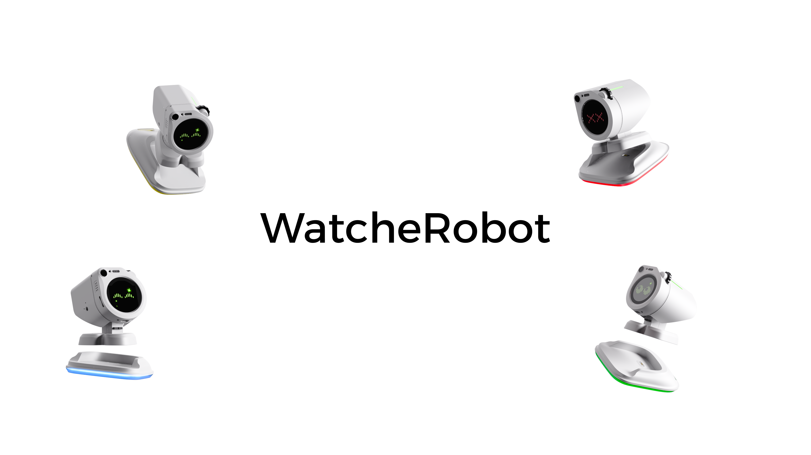

<div align="center">


<p><strong>English</strong> | <a href="README_zh.md">简体中文</a></p>



<p>Open firmware, hardware manufacturing files, mechanical model assets, and release tooling for the WatcheRobot desktop robot.</p>

<p>
  <a href="LICENSE"></a>
  
  
</p>

</div>

---

## Overview

WatcheRobot is a desktop robot project built around an ESP32-S3 main controller, an STM32F103 co-processor, custom PCB modules, and a mechanical assembly package.

This repository is the public reproduction package for WatcheRobot. It contains the parts needed to inspect the hardware, build the embedded firmware, prepare release assets, and validate board-level behavior. Product applications and server-side runtime packages are distributed through GitHub Releases when available; their source code is not part of this repository.

The current repository focuses on:

- ESP32-S3 firmware source and assets
- STM32F103 co-processor firmware source and host tests
- PCB manufacturing files: schematic PDFs, layout PDFs, Gerber, BOM, CPL, and EasyEDA Pro source
- Mechanical STEP assembly export
- Release coordination documents and flashing tools

## Repository Layout

```text
firmware/
  esp32-s3/       ESP32-S3 firmware source, assets, and ESP-IDF project files
  stm32-f103/     STM32F103 co-processor firmware, protocol code, and host tests

hardware/
  pcb/            PCB source, schematics, layout PDFs, Gerber, BOM, and CPL files
  3d-models/      Mechanical model exports
  assembly/       Assembly images or documents when available

docs/
  downloads.md        Release asset guide
  compatibility.md    Version compatibility matrix
  release-process.md  Release process and asset rules
  governance.md       Repository boundary notes

tools/
  esp32-flasher/  ESP32 release flashing guide
  win_flasher/    Windows ESP32 release ZIP flasher package
```

## Quick Start

### ESP32-S3 Firmware

Use ESP-IDF v5.2.1:

```bash
cd firmware/esp32-s3
idf.py set-target esp32s3
idf.py build
```

### STM32F103 Host Tests

```bash
cd firmware/stm32-f103
cmake --preset HostDebug
cmake --build --preset HostDebug
ctest --preset HostDebug
```

### Hardware Files

The PCB manufacturing package is under `hardware/pcb/`:

- `schematic/`: schematic PDF exports
- `layout/`: PCB layout PDF exports
- `gerber/`: decompressed Gerber and drill files
- `bom/`: per-board BOM files and a reusable Chinese BOM template
- `cpl/`: pick-and-place files
- `pcb-source/`: editable EasyEDA Pro project source

The mechanical assembly export is under `hardware/3d-models/exports/`.

## Public Scope

Open in this repository:

- embedded firmware source
- PCB and mechanical publication files
- public flashing and release tooling
- public release documentation

Distributed as release assets when available, but not open as source here:

- Android application package
- server runtime package
- desktop application installer
- prebuilt firmware binaries

See [docs/downloads.md](docs/downloads.md) for the expected release asset types.

## Tech Stack

| Area | Main Technologies |
| --- | --- |
| ESP32-S3 firmware | ESP-IDF, FreeRTOS, LVGL |
| STM32F103 firmware | STM32 HAL, CMake, host-side C tests |
| Hardware | EasyEDA Pro, Gerber, BOM, CPL, STEP |
| Release tools | Python, Windows flashing utilities |

## License

This repository is licensed under [GPL-3.0](LICENSE), unless a subproject or third-party component states otherwise in its own license file.
