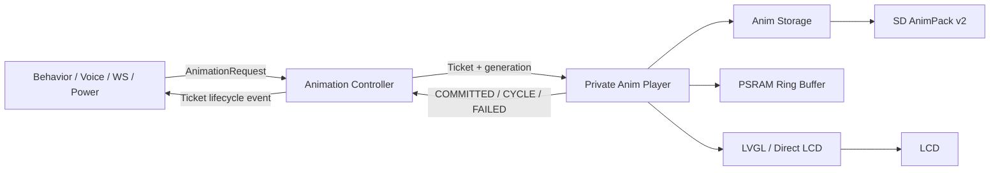

# Animation Service

WatcheRobot ESP32 动画服务以 Ticket 为单位接收业务意图，并保证每个已接受
Ticket 恰好进入一个终态。业务模块只依赖 `animation_service.h`；Player、
Storage、SD Worker 和 LVGL 渲染均为组件内部实现。

## 架构与边界



固定依赖方向为：

```text
Behavior -> Animation Service -> HAL Display
```

边界规则：

- `animation_service.h` 是唯一公开控制接口。
- `anim_player.h` 仅供本组件使用，业务代码不得 include 或调用
  `emoji_anim_*`。
- HAL 只提供显示 Surface 和 LCD 能力，不决定动画优先级、抢占或完成时机。
- 生命周期事件在 Controller 内部锁释放后投递；回调只能复制事件到业务队列。

## 公开接口

```c
#include "animation_service.h"

animation_request_t request = {
    .type = EMOJI_ANIM_LISTENING,
    .priority = ANIM_PRIORITY_INTERACTION,
    .preempt_policy = ANIM_PREEMPTIBLE,
    .repeat_count = 0,
    .source = ANIM_SOURCE_VOICE,
    .owner_epoch = session_epoch,
    .correlation_id = correlation_id,
};

animation_ticket_t ticket = ANIMATION_TICKET_INVALID;
animation_service_result_t result = animation_submit(&request, &ticket);
```

公开能力包括提交、取消、owner 批量取消、预取提示、快照、事件接收器、
Surface bind/unbind、suspend/resume 和 Overlay 保护区域。正常动画推进只依赖
`COMMITTED`、`CYCLE_COMPLETED`、`COMPLETED` 等事件；timeout 只用于把
卡住的准备过程转换为 `FAILED(PREPARE_STALLED)`。

## 单一 Registry

`animation_registry.json` 是动画类型的唯一真源，包含：

- 稳定且只允许尾部追加的 numeric ID；
- canonical name、alias、候选源文件名；
- 默认 loop、编码和 required 属性；
- 全局 fallback FPS。

修改 Registry 后，从 `firmware/s3` 运行：

```powershell
python tools/generate_animation_registry.py
python tools/generate_animation_registry.py --check
```

生成并提交：

- `include/animation_registry_generated.h`
- `src/animation_registry_generated.c`
- `tools/animation_registry_generated.py`

Registry 不再生成 UI emoji enum 或 UI ID 映射。服务端/桌面端状态字符串通过
canonical name/alias 解析，不建立第二套类型表。

## 资源与运行时规则

GIF 只用于离线制作。生成器将每帧转换为 RGB565/Indexed8 payload，并输出：

```text
<sd-root>/
  resource_manifest.json
  anim/
    anim_manifest.bin
    <canonical-name>.animpack
```

配置优先级：

1. AnimPack 帧描述中的逐帧 delay；
2. Manifest v2 中的 FPS、frame count 和 loop；
3. Registry 的 `default_loop` 与 `default_fps`（FPS 可由
   `CONFIG_WATCHER_ANIM_FPS` 覆盖）作为缺省值。

加载时会校验 Registry ID/canonical name、Manifest 尺寸/帧数以及 Pack Header。
设备端不再读取独立的运行时 JSON 元数据，避免 SD 资源与固件出现第三套配置。

资源生成：

```powershell
python tools/generate_animation_registry.py --check
python tools/generate_anim_assets.py --input-dir assets/gif --clean
python tools/sync_anim_sdcard.py --target-root F:\
```

`--extra-anim-type` 只能引用已注册 canonical name；未注册类型会直接失败，
不会生成固件不可访问的资源。

## 验证

从仓库根目录运行：

```powershell
python -m pytest tools/tests/test_animation_registry_codegen.py
python -m pytest tools/tests/test_generate_anim_assets.py tools/tests/test_sync_anim_sdcard.py
git diff --check
```

Registry 测试同时执行 `--check`、验证 0..32 既有 ID 不变，并静态禁止
`anim_service` 外部绕过公开 API。
