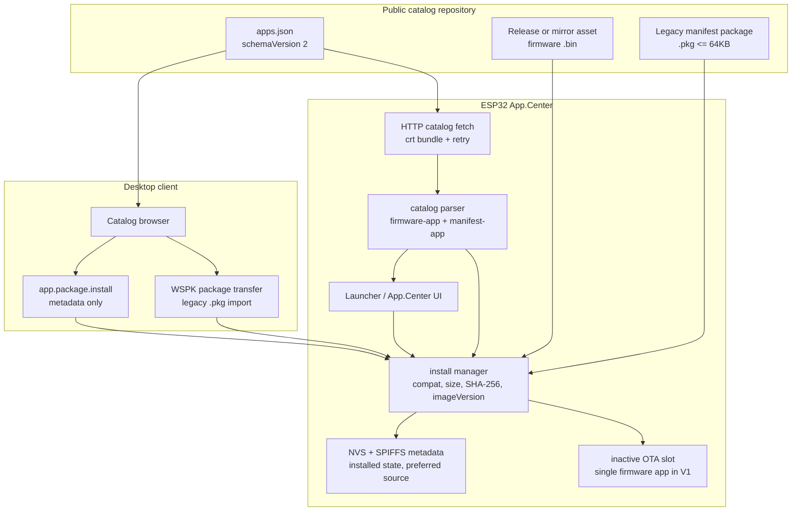
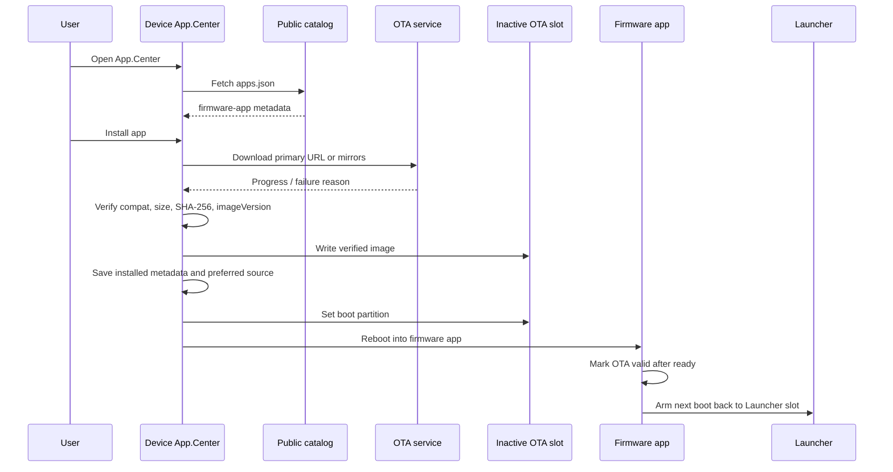

# App.Center app-pack contract

App.Center is the downloadable app store inside the local Launcher architecture.
It must not contain Launcher-local functions such as BLE App, Client App, Phone
Control, Voice App, Agent App, Provision App, or App.Center itself.

## Runtime boundary

- Launcher owns local built-in apps.
- App.Center owns downloadable app catalog, install state, package download,
  package uninstall, and package launch.
- System OTA for the Launcher remains a separate firmware-update path.
  App.Center v2 may install `firmware-app` entries into the inactive OTA slot
  as ecosystem apps.
- V1 keeps the existing `ota_0` / `ota_1` partition layout. A device can retain
  only one installed firmware app at a time; installing a new firmware app
  overwrites the inactive OTA slot that previously held the old app.
- Legacy 64KB JSON manifest packages remain supported for `manifest-app`
  entries and catalog entries without `type`.

## Architecture

App.Center v2 makes the public catalog the shared source of truth. The device UI
and desktop UI may both browse the same catalog, but the ESP32 remains the
installer of record: it validates compatibility, downloads package assets, owns
installed metadata, and controls boot-slot switching.



Firmware-app install sequence:



## Catalog shape

`apps.json` may be either:

```json
[
  {
    "id": "pixel-game",
    "name": "Pixel Game",
    "description": "A tiny downloaded app-pack demo",
    "packageUrl": "pixel_game.example.pkg",
    "version": "game-v1"
  }
]
```

or:

```json
{
  "apps": [
    {
      "id": "pixel-game",
      "name": "Pixel Game",
      "description": "A tiny downloaded app-pack demo",
      "packageUrl": "pixel_game.example.pkg",
      "version": "game-v1"
    }
  ]
}
```

`data` is also accepted as an array key for compatibility with simple API
wrappers.

Catalog v2 uses an object with `schemaVersion = 2`:

```json
{
  "schemaVersion": 2,
  "apps": [
    {
      "id": "pixel-lab-firmware",
      "name": "Pixel Lab Firmware",
      "type": "firmware-app",
      "version": "0.1.0-dev",
      "compat": {
        "product": "WatcheRobot",
        "chip": "esp32s3",
        "flashSizeMb": 16,
        "otaSlotSize": 4194304,
        "minLauncherVersion": "0.0.0"
      },
      "firmware": {
        "url": "https://example.com/watche-app-center/pixel-lab-firmware-esp32s3.bin",
        "sha256": "64-char-sha256-hex",
        "sizeBytes": 1048576,
        "imageVersion": "pixel-lab-v0.1.0",
        "signature": {
          "algorithm": "unsigned-dev"
        }
      }
    }
  ]
}
```

## Catalog fields

Supported app fields:

- `id` / `appId` / `key`: stable app id.
- `name` / `appName` / `title`: display name.
- `description` / `desc` / `appDescription`: display description.
- `iconUrl` / `appIcon` / `icon`: reserved for future icon support.
- `packageUrl` / `downloadUrl` / `appUrl` / `url`: app package URL.
- `version` / `fwVersion` / `firmwareVersion`: display version string.
- `type`: `firmware-app`, `manifest-app`, or `resource-app`. Missing `type`
  keeps the legacy manifest package behavior.
- `compat.product`: must be `WatcheRobot` for firmware apps.
- `compat.chip`: must be `esp32s3` or `esp32-s3` for firmware apps.
- `compat.flashSizeMb`: required flash size in MB.
- `compat.otaSlotSize`: maximum required OTA slot size; V1 rejects values over
  `0x400000`.
- `compat.minLauncherVersion`: minimum Launcher firmware version.
- `firmware.url`: HTTPS firmware `.bin` URL for `firmware-app`.
- `firmware.sha256`: SHA-256 of the exact release asset.
- `firmware.sizeBytes`: release asset size; V1 rejects zero and values over the
  OTA slot limit.
- `firmware.imageVersion`: expected ESP app image version.

For legacy manifest packages, do not use `firmwareUrl` or `otaUrl`; those names
are reserved for firmware app entries.

## Relative package URLs

`packageUrl` may be absolute:

```json
"packageUrl": "http://192.168.1.10:8767/pixel_game.example.pkg"
```

or relative to the `apps.json` URL:

```json
"packageUrl": "pixel_game.example.pkg"
```

If `CONFIG_APP_CENTER_REMOTE_LIST_URL` is
`http://192.168.1.10:8767/apps.json`, the relative package URL resolves to
`http://192.168.1.10:8767/pixel_game.example.pkg`.

## Package manifest

The first app-pack format is a small JSON manifest. It is enough for the device
to download, install, uninstall, and open a downloaded app shell.

Supported package fields:

- `id` / `appId` / `app_id`: app package identity used by App.Center install,
  open, uninstall, and list status.
- `runtimeAppId`: reserved for future runtime-backed app packages. Current
  product packages open through the generic downloaded app shell or the
  `firmware-app` OTA path.
- `name` / `title` / `appName`: app shell title.
- `description` / `desc` / `message`: app shell display text.
- `state` / `stateId` / `behavior`: behavior state id.
- `anim` / `animation` / `animId`: animation id.
- `permissions`: optional string array. Current allowed values are
  `servo`, `display`, `sound`, and `storage`.
- `signature`: optional object for developer or production package trust.
  Local developer packages may use `algorithm = "unsigned-dev"` when
  `CONFIG_APP_CENTER_ALLOW_UNSIGNED_DEV_PACKAGES` is enabled. Production
  packages must use `algorithm = "ecdsa-p256-sha256"` and provide `digest`,
  `issuer`, `publicKeyPem`, and `signature` or `value`.

The current device-side JSON app-pack is limited to `64KB`. Larger animation,
audio, model, or game resources should be distributed as SD/resource packs and
referenced by manifest metadata instead of being embedded into this SPIFFS app
package.

Example:

```json
{
  "appId": "pixel-game",
  "name": "Pixel Game",
  "description": "A tiny downloaded app-pack demo.",
  "state": "standby",
  "anim": "standby",
  "permissions": ["display"],
  "signature": {
    "algorithm": "ecdsa-p256-sha256",
    "issuer": "developer-key-id",
    "digest": "sha256-of-manifest-without-signature-field",
    "publicKeyPem": "-----BEGIN PUBLIC KEY-----\\n...\\n-----END PUBLIC KEY-----\\n",
    "signature": "base64-der-ecdsa-signature-over-digest"
  }
}
```

Production signing rules:

- The signed digest is SHA-256 over the compact JSON representation of the
  manifest after removing the top-level `signature` object. Use the desktop
  `appcenter:sign` tool as the source of truth for this canonical form.
- The device recomputes this digest and compares it to `signature.digest`.
- Any manifest field change after signing must be re-signed; digest or ECDSA
  verification failure after manual edits is expected security behavior.
- The device hashes `signature.publicKeyPem` with SHA-256 and requires that hash
  to be present in `CONFIG_APP_CENTER_TRUSTED_SIGNATURE_PUBLIC_KEY_SHA256`.
- If `CONFIG_APP_CENTER_TRUSTED_SIGNATURE_ISSUERS` is not empty,
  `signature.issuer` must also be present in that issuer allowlist.
- The device verifies `signature.signature` / `signature.value` as a base64 DER
  ECDSA P-256 SHA-256 signature using mbedTLS.

## Launch behavior

- Downloaded manifest packages open through the generic downloaded app shell and
  render the package manifest fields.
- `firmware-app` entries open by setting the boot partition to the inactive OTA
  slot and rebooting into the installed firmware app. The firmware app should
  mark OTA valid after it reaches a usable state, then arm the next boot back to
  the Launcher slot. A user-visible exit from the firmware app should reboot
  into that armed Launcher slot instead of exposing the firmware app image's
  local Launcher/App.Center copy.
- Local Launcher apps are not installed, opened, or uninstalled through
  App.Center.

## Desktop transfer path

The desktop client can also send app packages through watcher-server using the
existing hardware WebSocket channel:

1. `app.package.transfer.begin`
2. WSPK binary frames with frame type `5`
3. `app.package.transfer.commit`
4. `app.package.install`
5. `app.package.open`
6. `app.package.uninstall`
7. `app.package.list`

The ESP32 WebSocket layer only parses protocol messages and dispatches them to
the registered App.Center package handler. Package storage, manifest validation,
installed state, open, uninstall, and list generation stay inside `app_center.c`.
This keeps transport code and app-store state separated.

`app.package.install` is the V1 remote firmware-app command. The desktop sends
catalog metadata (`app_id`, `type`, `version`, `source_url`, `sha256`,
`size_bytes`, and `image_version`); the ESP32 downloads the firmware itself,
verifies SHA-256, writes the inactive OTA slot, records installed metadata, and
reboots into the firmware app. The desktop does not upload large firmware
binaries through WSPK.

Current device-side implementation:

- Receives package metadata from desktop.
- Writes WSPK app-package frames to `/spiffs/app_center/*.tmp`.
- Clears any previous incomplete desktop package transaction before accepting a
  new `app.package.transfer.begin`.
- Reports device-side receive progress through `evt.app.package.status`.
- Reports `install_failed` through `evt.app.package.status` before clearing the
  transaction when a package frame payload is invalid, too large, or cannot be
  written to storage.
- Checks the received byte count when `size_bytes` is provided.
- Rejects packages larger than the current device-side app-pack limit.
- Verifies SHA-256 when the desktop provides a hash.
- Reports a `verifying package` status before final manifest/hash checks.
- Validates the JSON package manifest before finalizing install.
- Requires the manifest `id`, `appId`, or `app_id` to match the package id
  being installed.
- Rejects packages that declare an incompatible `compat.product`, `compat.device`,
  or `compat.target`.
- Rejects numeric-version downgrades when an installed package metadata version
  already exists. For example, installing `1.1.0` over `1.2.0` is rejected.
  Non-numeric developer versions are not force-compared.
- Validates declared permissions against the current permission whitelist.
- Validates signature metadata shape when a package declares `signature`.
- Verifies production `ecdsa-p256-sha256` signatures against the configured
  trusted public key SHA-256 allowlist.
- Applies the device trust policy:
  - `CONFIG_APP_CENTER_ALLOW_UNSIGNED_DEV_PACKAGES` controls whether packages
    without a production signature, or packages declaring
    `signature.algorithm = "unsigned-dev"`, may be installed.
  - `CONFIG_APP_CENTER_TRUSTED_SIGNATURE_ISSUERS` is an optional
    comma-separated issuer allowlist for packages declaring a production
    signature algorithm.
  - `CONFIG_APP_CENTER_TRUSTED_SIGNATURE_PUBLIC_KEY_SHA256` is a comma-separated
    public key hash allowlist used as the production signing trust anchor.
- Renames the temp package to the installed package path.
- Clears the temporary transfer state after app-package frame write failure,
  successful install, failed commit validation, or explicit
  `app.package.transfer.abort`.
- Checks App.Center SPIFFS storage before HTTP package download, desktop
  package transfer begin, and each incoming package chunk. The install manager
  reserves a small safety margin so users get an explicit storage failure
  instead of a late, ambiguous write failure.
- Ignores stale `app.package.transfer.abort` commands whose `command_id` or
  canonical app id does not match the currently active transfer. This prevents a
  delayed abort from an older desktop/server transaction from deleting a newer
  package transfer.
- Stores installed state in App.Center NVS.
- Stores a small `.meta` file so downloaded/custom app names and versions can
  be restored after reboot.
- Treats a `firmware-app` as installed only when the saved `.meta` type,
  catalog-facing version, firmware SHA-256, and image version still match the
  current catalog entry. A catalog update makes the old OTA slot stale and
  changes the visible action back to install/download.
- Sends `evt.app.package.status` and `evt.app.package.list` through WebSocket.
- Supports desktop-triggered open and uninstall.
- Provides `app_center_get_manager_snapshot()` for Settings/About and desktop
  surfaces that need installed app, storage, and firmware slot summaries without
  directly scanning App.Center private storage.
- Uses the same `app_center_uninstall_app()` path for device UI and
  `app.package.uninstall`.
- Uninstall never modifies the remote catalog, desktop package cache, or
  Launcher-local apps.
- `manifest-app` uninstall clears installed NVS state and removes `.pkg`,
  `.pkg.tmp`, and `.meta` files from `/spiffs/app_center`.
- `firmware-app` uninstall clears installed state, preferred source metadata,
  and the `.meta` file, but does not erase the OTA slot. The old image remains
  reserved OTA space and is overwritten by the next firmware-app install.
- The device App.Center detail page uses two-step removal: the first
  `Uninstall` action changes the destructive action to `Confirm remove`; the
  `Open` action cancels that confirmation state.
- After a successful uninstall, the device reports
  `evt.app.package.status = uninstalled` when the command has a `command_id`.
  Desktop clients should treat `uninstalled`, `removed`, or `deleted` as
  terminal removal states and drop that app from the visible device app list.
- If `app.package.open` finds that the package file no longer exists, the device
  must report `uninstalled` instead of `open_failed`. `open_failed` means the app
  is still installed but could not be launched; reporting it for a missing
  package would leave desktop clients showing a stale installed app.
- `app.package.list` prepares App.Center package storage and reloads persisted
  package metadata on demand, so the desktop can refresh installed apps even
  when the device is not currently showing the App.Center UI.

Settings/About consumes the App.Center manager snapshot and appends four compact
system overview blocks after Wi-Fi MAC:

- `Apps`: installed app count, with `Manage in App.Center` as the management
  hint.
- `Storage`: SPIFFS used / total, or `Unavailable` if storage cannot be queried.
- `Memory`: internal heap free / largest block. DMA and PSRAM heap snapshots are
  collected for diagnostics but intentionally not shown in V1 to keep the page
  readable.
- `OTA Slot`: installed firmware-app name, or `Empty / available`.

Still required before treating this as a full production security boundary:

- Device-side manual acceptance with production signed packages, including valid
  trusted packages and invalid digest, issuer, and key rejection cases.

## Validation

From the workspace root:

```powershell
yarn appcenter:validate
```

This validates the sample catalog and relative package manifests before serving
the catalog to the device. The validator also rejects local Launcher apps such
as `ble.app`, `client.app`, `phone.control.app`, `phone-control`, `voice.app`,
`agent.app`, `provision.app`, `app.center`, and their display names, because
they must not be installed through App.Center.
